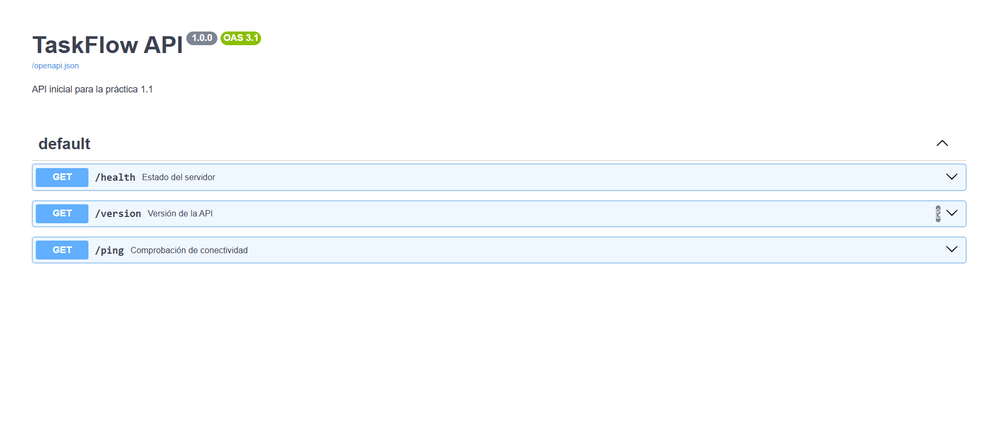

# Entregable Práctica 1.1 — Primeros endpoint y estructura inicial

- **Estudiante**: Ander Chans
- **Repositorio Git**: https://github.com/srchans1609-stack/taskflow-api

## Captura de Pantalla Swagger UI (/docs)

